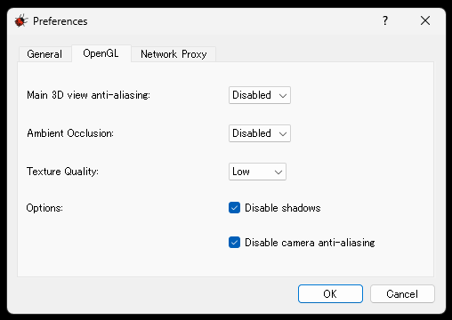

# 1.かしこいロボット（１）
ロボットの仕組みの学習&ロボットシミュレータのセットアップ
_____

[出席パスワード入力フォーム](https://forms.gle/qmA3uY4vrfnSGVhV8)

## 0.目次
1. [情報テクノロジー体験演習の目的](#1情報テクノロジー体験演習の目的)
2. [ロボットシミュレーターwebots](#2ロボットシミュレーターwebots)
3. [かしこいロボットの演習の進め方](#3かしこいロボットの演習の進め方)
4. [ロボットの仕組み](#4ロボットの仕組み)
5. [かしこいロボット第1回レポート](#5かしこいロボット第1回レポート)

## 1.情報テクノロジー体験演習の目的

- IT(情報テクノロジー)は、機能や知能が宿る実体(ハードウェア)と、その制御(ソフトウェア)との集合体であることを、演習を通じて感覚的に覚える。
- 授業内容
    - Tinkerbotsには、かしこい動作を実現するためのセンサやモータが用意されている
    - 演習では、Tinkerbotsを仮想空間上で動かせるロボットシミュレータWebotsを用いる

## 2.ロボットシミュレーターWebots

- 3次元モデル
- 物理シミュレーション：物体同士の衝突、物理の法則の再現
- ロボットのモデル化：モータ、センサ、制御プログラムの再現

## 3.かしこいロボットの演習の進め方

- 事前学習
    - GitHub上で配布される講義資料を事前にダウンロードし、講義内容を予習するべきである。
    - しかし、担当者の資料作成速度が追い付かないため、事前学習は無くて良いものとする。
- 出席
    - Googleフォームでの出席登録
- レポート
    - 毎回、レポートのテンプレート（問題用紙）をダウンロードし、テンプレートに記載の設問に回答する。
    - 演習内容についての設問＋各回のテーマに関する論述の設問
    - 提出期限は、翌週の水曜日２４時まで
    - 課題およびレポートのテンプレートは授業最後に説明する
    - １つでも未提出のレポートがあると、単位認定されない

## 4.ロボットの仕組み

ロボットは、主に以下の3つで動いています。

〇 **センサ**……状況を感じ取る  
〇 **コンピュータ**……思考して判断する  
〇 **アクチュエータ(モータ)**……行動する

Tinkerbotsの場合も、同様に三要素が揃って動くことができます。

- センサ
    - 距離センサ
    - タッチセンサ
    - カラーセンサ
    - 角度センサ
- コンピュータ
    - コンピュータ
- アクチュータ(モータ)
    - 車輪
    - ツイスト
    - ピボット
    - グリッパ

ロボットは、  
**センサ**が情報を与える  
　↓  
**コンピュータ**が思考・判断する  
　↓  
**アクチュエータ(モータ)**が命令を与えられ動く  

この流れを、実際にWebotsを動かしていくことで理解しようというのがこの授業の目的です

## 5.かしこいロボット第1回レポート

- 課題内容
    - [webots1_xxxxxxxx.docx](./webots1_xxxxxxxx.docx)を参照
        -  演習の進度によって講義中に課題内容を変更する場合があります。
- 提出要領
    - 提出先：[Googleフォーム](https://forms.gle/jWQEdSYTErKuJUnF9)
    - 提出期限：８月１３日（水）２４：００
    - ファイル名：Webots1_158xxxxx.docx
        - xxxxxxxxの部分は自分の学生番号に変更すること
    - Webots1_158xxxxx.docxを編集してレポートを作成すること
    - 最初のページの記入欄に、学生番号や名前等、必要事項を記入すること
    - 表紙や設問のフォーマットの変更は不可
    - 上記の注意を守らない場合、採点されないので注意すること

1. [Webotsのダウンロード](#1webotsのダウンロード)
2. [Webotsのインストール](#2webotsのインストール)
3. [初回起動の設定](#3初回起動の設定)

### 1.Webotsのダウンロード

以下の方法で、Webotsをダウンロードしてください。  
また、以下は**Windows11**の設定方法です。そうでない方はノリと勢いで設定したり自力で頑張るなりしてください

1. ユーザの種類が**ローカルアカウント**の**管理者**であることを確認してください
    満たしていない場合は、新しくユーザ作成をして下さい
2. [tinkerbots_updater.zip](./tinkerbots_updater.zip)をDLしてください。
3. [Webotsダウンロードページ](https://github.com/cyberbotics/webots/releases/tag/R2019a-rev1)から`webots-R2019a-rev1_setup.exe`をダウンロードしてください。

> [!WARNING]
> 1.31GBほどダウンロードすることになるので、時間と容量を十分確保してください。  
> ダウンロードの失敗していないかを確かめるために、DLしたファイルのプロパティからサイズが1.29GB以上あることを確認してください。  
> もし何かおかしい場合は、削除してから再DLしてください。

### 2.Webotsのインストール

1. `webots-R2019a-rev1_setup.exe`を発火させる。 
2. `Next`を押し続け、`Install`を選択する。  
3. `Launch Webots`のチェックを外してから`Finish`をクリックする。  
4. デスクトップにWebotsのショートカットが作成されたことを確認する。

### 3.初回起動の設定

1. 設定変更
    1. アイコンをダブルクリックし、ソフトを起動する。
    2. `Welcome to Webots R2019a revision 1`タブにて、以下のようにする。
        - 任意のテーマを選択する
        - 一番下にある`Allow to send lightweight anonymous technical data to Webots developers.`のチェックを**外す**
        以上の二つが済んだら、startを選択し次に進む。
    3. `Check for updates`タブにて、`don't display this dialog again (you an re-enable it from the perferenxes)`にチェックを入れ、OKを選択し次に進む。
    4. `Guided Tour - Webots`のタブにて、`Webots Guided Tour`を展開し、`tinkerbots_demo.wbt`を選択し`Close`を選択。
    5. 画面上部のメニューバーから`tools`→`Preferences`を開き、下の画像のように設定を変える。
    

2. シミュレーション環境の構築
    1. メニューバーの`Wizards`から`New Projectt Directoyr…`を選択
    1. 次の画面ではそのまま`Next`を押す
    2. ディレクトリを`C:\my_project`に変更する
    3. `World settings`にある4つのチェックすべてにチェックを入れて次へ
    4. `tool`→`Prefeerences`から、`General`内にある`Startup mode`を`Pause`に変更し、OKをクリック

3. フォルダの初期設定
    1. `C:\my_project`に、以下のファイルが表示されていることを確認する。
        - controllers
        - libraries
        - plugins
        - protos
        - worlds
    2. 別ウィンドウとして`C:\Program Files\Webots\projects\robots\tinkerbots`を開き、そのフォルダ内にある全てのフォルダを、`C:\my_project`の中に**コピー**する。
    3. 既にDLした`tinkerbots_updater.zip`を解凍した中身を`C:¥my_project`へコピーする。
    4. 隠しファイルの表示をオフにし、以下のファイルが含まれていることを確認する。
        - controllers
            - (計**10個**のファイルとフォルダ)
        - libraries
            - (計**6個**のファイルとフォルダ)
        - protos
            - (計**29個**のファイルとフォルダ)
        - worlds
            - (計**17個**のファイルとフォルダ)
        - heder_generator.bat
        - template.c