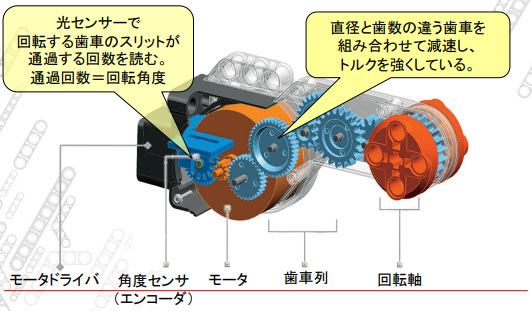
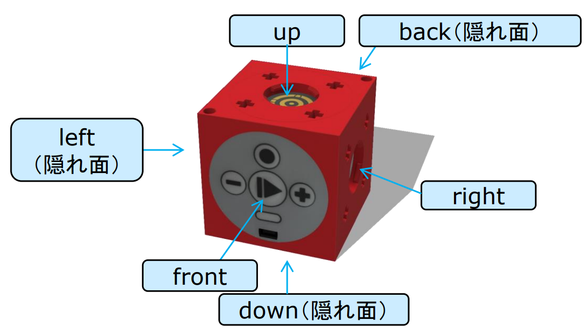

# 2.かしこいロボット（２）
モータの仕組みの学習、モータの演習  
センサの仕組みの学習、センサの演習
_____

[出席パスワード入力フォーム](https://forms.gle/xWSTEb1vdyjsGcnr6)

## 0.目次
1. [一般的なモータの構成](#1一般的なモータの構成)
2. [コントローラ・プログラムを動かす](#2コントローラプログラムを動かす)
3. [ロボットの改造](#3ロボットの改造)
4. [構文の説明](#4構文の説明)
5. [かしこいロボット第2回レポート](#5かしこいロボット第2回レポート)


## 1.一般的なモータの構成


###### 授業資料から引用

この画像のように、光センサの検出によって角度センサがどれくらい回転しているかを認識しているわけですね。

> [!TIP]
> 
> スリットの穴が360個開いている  
> →光センサの信号1つにつき1度、90回あれば90度＝直角
> 
> スリットが90個の場合
> →信号1つで4度分

Tinkerbotsのモータも、内部で以下のように動いています。

```
歯車を回す  
　↓  
角度センサで今どのくらい回ったかを検知　 
　↓  
目標の角度になるまで歯車を回し続ける
```

この繰り返しで、特定の角度まで回ったことを認識しているわけですね  
なので、目標の角度になるまでは少し時間がかかります。~~カスですね~~


## 2.コントローラ・プログラムを動かす

グダグダ言ってもうるさいだけなので、実際にプログラムを動かしてみましょう。  
まず、動かすためのワールド(現在表示されている床や壁)を作りましょう。空のワールドは取っておきたいため、新しい名前`my_robot01.wbt`として保存し、更にロボットを追加しましょう。

1. `File`→`Save World As…`を選択する
2. ファイル名を`my_robot01.wbt`として保存
3. 中央左にある`RectangleArena`を右クリックし、`Add New`を選択
4. そのまま`Import`を選択
5. `my_project\worlds\TinkerbotsBase.wbo`を開く
6. 画面中央左に`TinkerbotsBase`があり、かつ画面中央にロボットが表示されていることを確認し、上書き保存する

[about controller](../about_coontroller.md)にて、`my_controller2_1`という新しいコントローラーを作成し、現在の`TinkerbotsBase`に適応させましょう。  
右側のテキストエディタでコメントアウトに挟まれている部分にコードを書きこむことでロボットを動かしていきます。  
試しに、14行目に以下のようなコードを打ち込んでみましょう。  

```c
Steering("A","B","0","100");
```

ツールバーにある歯車のマークを押しビルドをして再生マークを押すと、ロボットが直進してくれることと思います。  
この引数にあるA,Bは、車輪についているモータを指定しています。

Aは右(コンピュータに近い)車輪、Bは左(コンピュータから遠い)車輪を指します。

ロボットの動作では、ただ動作命令を与えるわけにはいきません。その命令をどの程度続けるかを条件付けしてあげなければいけませんね。  
試しに、以下のコードを打ち込んでみましょう。

```c
Steering("A","B","0","100");
Keep_until("Timer","","","2");
```

詳しい構文の説明は後にしますが、こうすることで「まっすぐ進む」動作を「2秒間繰り返す」ことができます。


## 3.ロボットの改造

0. [ロボットに部品を追加する](#0ロボットに部品を追加する)
1. [回転センサ](#1回転センサ)
2. [タッチセンサ](#2タッチセンサ)
3. [距離センサ](#3距離センサ)
4. [カラーセンサ](#4カラーセンサ)

### 0.ロボットに部品を追加する

Tinkerbotsのキューブ状の部品は、**Slotノード**によって構成されており、ここに部品を追加することができます。  


> [!NOTE]
> 車輪Aのモータは`TinkerbotsBase`→`downSlot TinkerbotsMotor`  
> 車輪Bのモータは`TinkerbotsBase`→`rightSlot TinkerbotsCube`→`rightSlot TinkerbotsMotor`  
> にそれぞれ入っています。

今回はさほど重要ではありませんが、最終課題でとても重要になるので頭に入れておいてくださいね。

### 1.回転センサ

1. 別ワールドとして保存
    1. `File`→`Save World As…`から`my_robot02.wbt`という名前で保存
2. ロボットの位置調整(移動を分かりやすくするため)
    1. `TinkerbotsBase`→`translation`にて、オブジェクトの位置を__`x=-0.02`,`y=0.02625`,`z=-0.04`にする
    2. ロボットの中心がタイルの十字の中心と一致することを確認して、上書き保存する。
3. 新しいコントローラを作成
    1. [about controller](../about_coontroller.md)を参考に`my_controller2_2`を作成し適応させる。
    2. テキストエディタの14行目に以下のコードを入れる。
        ```c
        // 中括弧内の動作を繰り返す
        Repeat_until("Infinity","","",""){
            // 90°右にその場旋回
            Steering("A","B","100","15");
            Keep_until("Motor","A","=","-188");
            // 0.5[m]前進
            Steering("A","B","0","15");
            Keep_until("Motor","A","=","545");
        }
        ```

これによって、今まで(Timerで正方形を書いたイマジナリー課題参照)試行錯誤でやるしかなかったことを、回転センサを使い書くことが出来るようになりました。

> [!TIP]
> モータブロックをダブルクリックすることで開けるロボットウィンドウで、`PositionSensor`を選択すると、モータの回転角殿変化を確認することができます

> [!NOTE]
> |各部品|大きさ[m]|
> |:----|:----|
> |ブロックの一辺|0.04|
> |タイヤの半径|0.02625|
> |タイヤの厚さ|0.017|
> |タイルの一辺|0.25|


### 2.タッチセンサ

1. 別ワールドとして保存
    1. `File`→`Save World As…`から`my_robot03.wbt`という名前で保存

2. ワールドの設定
    1. `TinkerbotsBase`→`floorSize`にて、フィールドの縦横の長さを`x=0.6`,`y=0.4`にする。
    2. `TinkerbotsBase`→`floorTileSize`にて、タイル2枚分の大きさをx=0.4,y=0,4にする
    3. ワールドを上書き保存する

3. タッチセンサの追加
    1. `TinkerbotsBase`→`downSlot TinkerbotsMotor`→`upSlot NULL`で右クリックして`Add New`から、`PROTO nodes (Project)`→`TinkerbotsCube`→`Add`とすることで、**ただのキューブ**を追加する。(壁の高さと調整のため)
    2. `TinkerbotsBase`→`downSlot TinkerbotsMotor`が`upSlot NULL`から`upSlot TinkerbotsCube`になっていることを確認する。
    3. `TinkerbotsBase`→`downSlot TinkerbotsMotor`→`upSlot TinkerbotsCube`→`leftSlot NULL`で右クリックをし`Add New`から、`PROTO nodes (Project)`→`TinkerbotsTouchSensor(Slot)`→`Add`とし、Tinkerbotsに計2つのblockが追加されていることを確認する。
    4. `TinkerbotsBase`→`downSlot TinkerbotsMotor`→`upSlot TinkerbotsCube`→`leftSlot TinkerbotsTouchSensor`での`rotation`をangle=1.57、`name`を`1`(もしくは任意の名前)とする。

4. 新しいコントローラを作成
    1. [about controller](../about_coontroller.md)を参考に`my_controller2_3`を作成し適応させる。
    2. テキストエディタの14行目に以下のコードを入れる。
        ```c
        // 中括弧内を永遠に繰り返す
        Repeat_until("Infinity","","",""){
            // 90度回転する
            Steering("A","B","100","15");
            Keep_until("Motor","A","=","-193");
            // 停止動作を入れることで旋回角度をバラつかないようにする
            Steering("A","B","0","0");
            Keep_until("Timer","","","1");
            // タッチセンサが反応するまで直進
            Steering("A","B","0","50");
            Keep_until("Touch","1","","On");
            // 1秒後退する
            Steering("A","B","0","-30");
            Keep_until("Timer","","","1");
            // 1秒停止する
            Steering("A","B","0","0");
            Keep_until("Timer","","","1");
        }
        ```

### 3.距離センサ

距離センサは、超音波を前に出し障害物で反射する時間差から、障害物までの距離を測定している。

1. 別ワールドとして保存
    1. `File`→`Save World As…`から`my_robot04.wbt`という名前で保存

2. タッチセンサの削除
    1. `TinkerbotsBase`→`downSlot TinkerbotsMotor`→`upSlot TinkerbotsCube`を右クリックし、`Delete`する。

3. 距離センサの追加
    1. `TinkerbotsBase`→`downSlot TinkerbotsMotor`→`leftSlot NULL`で右クリックして`Add New`から、`PROTO nodes (Project)`→`TinkerbotsDistanceSensor(Slot)`→`Add`とすることで、**距離センサ**を追加する。
    2. `TinkerbotsBase`→`downSlot TinkerbotsMotor`→`leftSlot TinkerbotsDistanceSensor`での`rotation`をangle=1.57、`name`を`2`(もしくは任意の名前)とする。
    3. それっぽいセンサが付いていることを確認し、上書き保存する。

4. 新しいコントローラを作成
    1. [about controller](../about_coontroller.md)を参考に`my_controller2_4`を作成し適応させる。
    2. テキストエディタの14行目に以下のコードを入れる。
        ```c
        // 中括弧内を永遠に繰り返す
        Repeat_until("Infinity","","",""){
            // 90度回転する
            Steering("A","B","100","15");
            Keep_until("Motor","A","=","-193");
            // 一時停止
            Steering("A","B","0","0");
            Keep_until("Timer","","","1");
            // 距離が12センチ以下(と距離センサが認識するまで)直進する
            Steering("A","B","0","50");
            Keep_until("Distance","2","<","12");
            // 一時停止する
            Steering("A","B","0","0");
            Keep_until("Timer","","","1");
        }
        ```


### 4.カラーセンサ

本演習でのカラーセンサは、反射光に含まれる光の三原色の強度から、赤・青・緑・黄・白・黒を認識することができる。  
~~しかし、厳密なカラーコードで認識しているわけではないらしく、全く意味が分からないのである。~~

1. 別ワールドとして保存
    1. `my_robot02.wbt`を開く。
    1. `File`→`Save World As…`から`my_robot05.wbt`という名前で保存

2. ライントレースシートのインポート
    1. `TinkerbotsBase`で右クリックし、`Add New`→`Import…`をクリックする。
    2. `my_project\worlds\Sheeet.wbo`を開く。
    3. 床にラインコースが追加されていることを確認し、上書き保存する。

3. ロボット位置の変更
    1. `TinkerbotsBase`→`translation`から、`x=0.23`,`y=0.027`,`z=-0.04`に変更する。

4. カラーセンサの追加
    1. `TinkerbotsBase`→`downSlot TinkerbotsMotor`→`upSlot NULL`で右クリックし`Add New`から、`PROTO nodes (Project)`→`TinkerbotsColorSensor(Slot)`→`Add`とすることで、**カラーセンサ**を追加する。
    2. `TinkerbotsBase`→`downSlot TinkerbotsMotor`→`upSlot TinkerbotsColorSensor`にて、`rotation`を`angle=1.57`、`name`を`3`(もしくは任意の名前)とする。
    3. カラーセンサが付いていることを確認し、上書き保存する。

5. 新しいコントローラを作成
    1. [about controller](../about_coontroller.md)を参考に`my_controller2_5`を作成し適応させる。
    2. テキストエディタの14行目に以下のコードを入れる。
        ```c
        // 中括弧内の動作を無限に繰り返す
        Repeat_until("Infinity","","",""){
            // もし黒なら右前方に曲がる
            if(Is_it_true("Color","3","","Black")){
            Steering("A","B","50","50");
            }
            // そうでないなら(=線を飛び越して白を認識したら)左前方に曲がり軌道修正する
            else{
            Steering("A","B","-50","50");
            }
        }
        ```


## 4.構文の説明

今まで大した説明もせずに使っていた関数ですが、一覧をまとめました。  
[functions](../functions.md)  
……とまぁ多いしC言語じゃないしと随分面倒なので、勿論覚える必要はないと思っています。

## 5.かしこいロボット第2回レポート

- 課題内容
    - [webots2_xxxxxxxx.docx](./webots2_xxxxxxxx.docx)を参照
        -  演習の進度によって講義中に課題内容を変更する場合があります。
- 提出要領
    - 提出先：[Googleフォーム](https://forms.gle/ba7B6kMtjeVSjtma7)
    - 提出期限：８月２０日（水）２４：００
    - ファイル名：Webots2_xxxxxxxx.docx
        - xxxxxxxxの部分は自分の学生番号に変更すること
    - Webots2_xxxxxxxx.docxを編集してレポートを作成すること
    - 最初のページの記入欄に、学生番号や名前等、必要事項を記入すること
        - しかし、書きたくない場合はこれを強制しない。また、ふざけた回答も認める。
    - 表紙や設問のフォーマットの変更は不可
    - 上記の注意を守らない場合、採点されないので注意すること